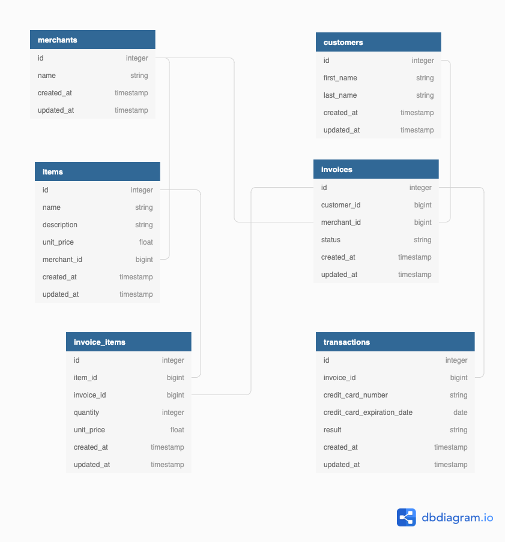

<body style="background: whitesmoke; white; color: gray; padding: 1em;">

# Rails Engine - Turing Module 3 Solo Project

## Summary

  - [Turing's Project Scope](#Scope)
  - [Getting Started](#getting-started)
  - [Runing the tests](#running-the-tests)
  - [Deployment](#deployment)
  - [Built With](#built-with)
  - [Contributing](#contributing)
  - [Versioning](#versioning)
  - [Authors](#authors)
  - [License](#license)
  - [Acknowledgments](#acknowledgments)


<div style="background: green;color: white; padding: 2em; margin-bottom: 2em; margin-top: 2em">

## Turing's Project Scope

### Description
---

You are working for a company developing an E-Commerce Application. Your team is working in a service-oriented architecture, meaning the front and back ends of this application are separate and communicate via APIs. Your job is to expose the data that powers the site through an API that the front end will consume.

---
### Rails Driver
**[Rails Driver](https://github.com/turingschool-examples/rails_driver)** is the front end of the application. It includes a test suite as well as a front end to test your application. Instructors will use this to determine the completion of your project.

It should be noted that in most professional applications, the front end would not be written in Rails. More likely, a pure front end application would use a Javascript framework such as React. However, in order to make this portion of the project more understandable to BEM3 students we have written it in Rails. The extensions for this project will build on this front end application.

---
### Technical Requirements

The Technical Requirements for this project can be found [here](https://backend.turing.io/module3/projects/rails_engine/requirements)

---
### Evaluation

Evaluation details can be found [here](https://backend.turing.io/module3/projects/rails_engine/evaluation)

</div>
<p></p>


## Getting Started

These instructions will get you a copy of the project up and running on
your local machine for development and testing purposes. See deployment
for notes on how to deploy the project on a live system.

### Prerequisites

We'll be running this app in:

    - Ruby 2.5.3
    - Rails 5.2.4.3

### Installing

### Install the Engine

Please run the following commands in your terminal:

##### 1. Clone the repository to directory of choice

```
git clone git@github.com:nicorithner/rails_engine.git
```

##### 2. Install all gems

```
bundle install
```

##### 3. Create database

```
rails db:{create,migrate}
```

##### 4. Import CSV data to seed the database

```
rails import
```
It will take a moment. You'll see:

    $rails import
    Customer data imported!
    Merchant data imported!
    Invoice data imported!
    Item data imported!
    InvoiceItem data imported!
    Transaction data imported!

### Install the Driver

Please follow this link to find the 'Rails Driver' repo and clone it.

- **[Clone Rails Driver repo from here](https://github.com/turingschool-examples/rails_driver)**

Follow the instructions in its README file to install it.


## Running the tests

To run the test suite inside of Rails Engine please run the following command:

```
bundle exec rspec
```

1. To get Rails Engine working with Rails Driver, open up a new terminal tab or window.

2. In your terminal tab or window with Rails Engine, type the command.
    ```
    rails server.
    ```
    To shut down the server hold down the 'control' button on Mac and press the key 'c'.

3. Then, in your terminal tab or window with Rails Driver, type the command `bundle exec rspec` to run its test suite.

## Usage

With Rails Engine still running, open your API consumption tool of choice, such as Postman or just a regular Internet browser.

Then, begin your query to the API by using the following root URI on all queries:

```
http://localhost:3000/api/v1/
```

### Schema




</body>